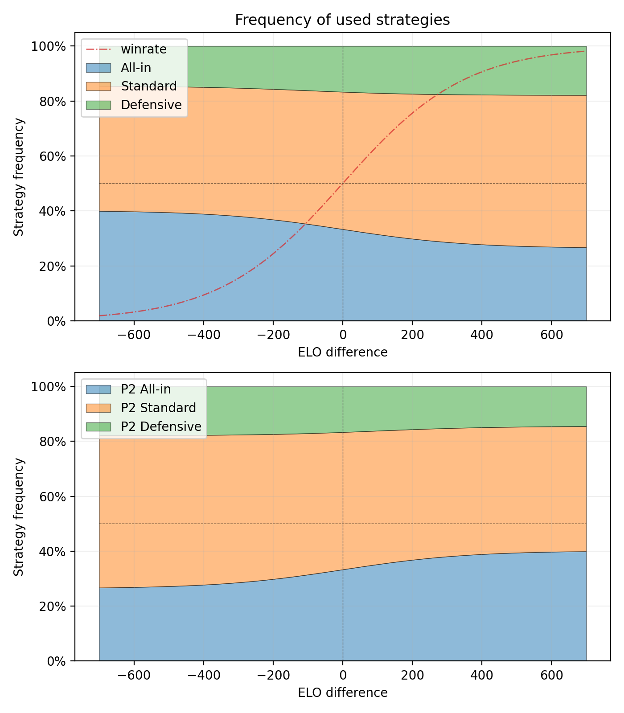
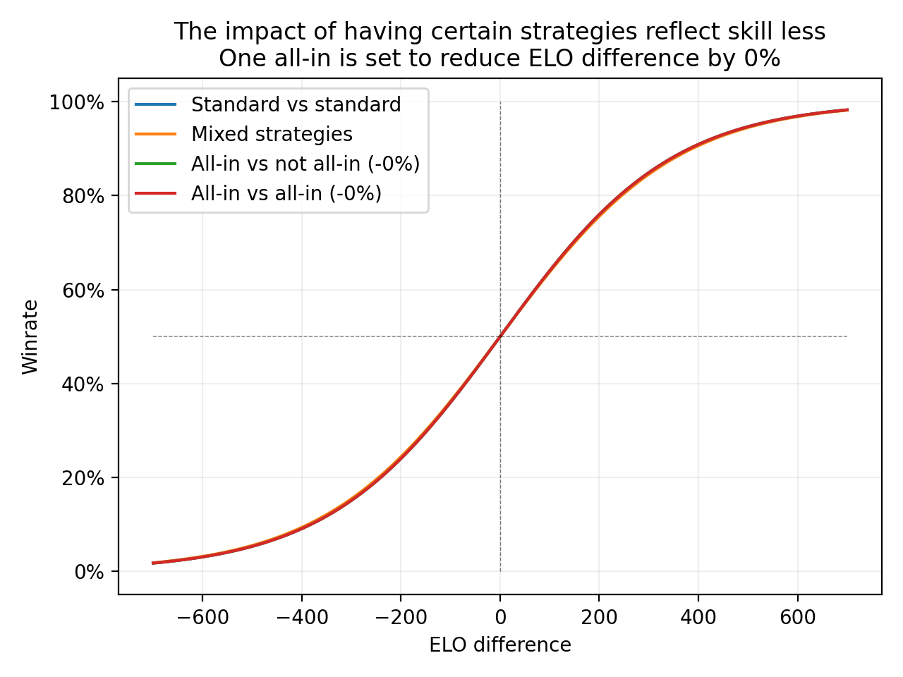

# Calculating mixed-strategy nash equilibria

In this project I calculate mixed-strategy nash equilibria for three strategies

* Allin
* Standard
* Defensive

Each strategy has and advantage against another strategy.

|[P1↓ P2→]     |  Allin  | Standard | Defensive|
|--------------|---------|---------|-----------|
|Allin         |   50%   |   55%   |    35%    |
|Standard      |   45%   |   50%   |    60%    |
|Defensive     |   65%   |   40%   |    50%    |

#

Player skill is taken into account and represented with ELO points. Strategy advantages against each other is represented as ELO bonus points. Game-theoretic solution is calculated at various player skill differences.

Allin strategy represents a strategy where randomness plays a significant role. This is done by reducing skill difference by 50% when there is one allin strategy present, and by 75% with two allins against each other.

Without the reduction of skill difference by allins. All strategies stay viable on all skill differences.

Comparing winrate when using different strategies or a mix of them.

Without the reduction of skill difference by allins this becomes a single curve.

